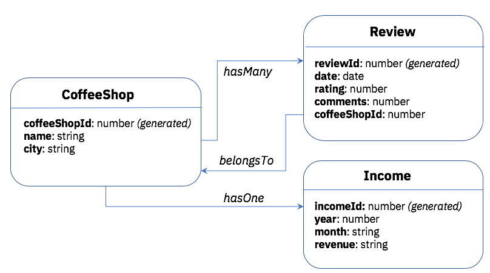

# LoopBack4 CoffeeShop

_Working in progress_

## User flow

1. Create the models
2. use `automigrate` feature to create the database
3. update the database with the foreign key information

## What I want to show in this LB4 app

1. How to use model relations (`hasMany`, `belongsTo` and `hasOne` for now) and set up the corresponding database tables
2. How to do customization

[-@2x.png>)](http://loopback.io/)

Photo Credits: https://www.pexels.com/photo/six-white-ceramic-mugs-1251175/
