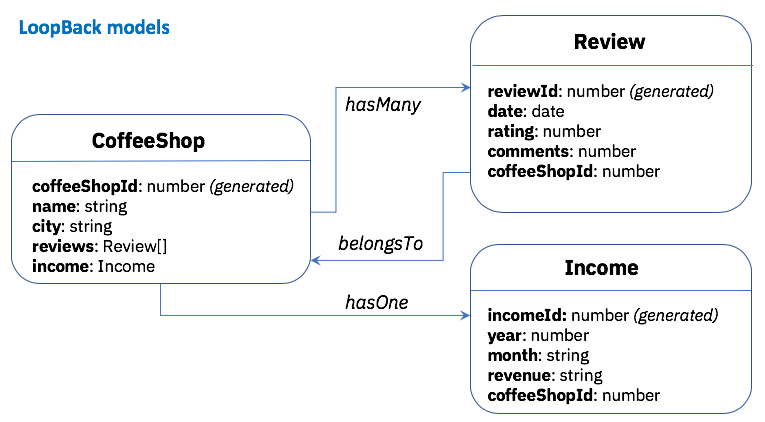

# LoopBack4 CoffeeShop

[-@2x.png>)](http://loopback.io/)


_Photo Credits: https://www.pexels.com/photo/six-white-ceramic-mugs-1251175/_

_Working in progress_

## CoffeeShop Application Overview

In this CoffeeShop example, there are 3 entities:

- **CoffeeShop**: the main entity of this example
- **Review**: review of a particular coffee shop
- **Income**: income of a particular coffee shop

A coffee shop can have multiple reviews. As illustrated in the diagram below, the `CoffeeShop` model has a `hasMany` model relation with the `Review` model. Besides, the `CoffeeShop` model has only one `Income` instance, thus has a `hasOne` model relation with `Income` model.



## User flow 1: From models > Database

1. Create the models and model relations

- when `lb4 relation` is ready, it should be even easier
- TODO: there might be steps needed which are documented in https://github.com/strongloop/loopback-next/pull/2448

2. Use `automigrate` feature to create the database

- order of database tables are important. Modify [database migration script](src/migrate.ts).
- run `npm run migrate`

3. Modify [CoffeeShopRepository](src/repositories/coffee-shop.repository.ts) to be able to access the ReviewRepository

4. Create [`CoffeeShopReviewController`](src/controllers/coffee-shop-review-controller.ts)
   This is used to do the CRUD operations for reviews related to the coffee shop.

## User flow 2: From database > models

Use `lb4 discover` to discover the models.

## Running the app

Run `npm start`.
Go to `localhost:3000/explorer`.

1. Create some coffee shops - POST /coffee-shops

```json
{
  "name": "My Toronto shop",
  "city": "Toronto"
}
```

```json
{
  "name": "My NYC shop",
  "city": "New York City"
}
```

To verify it is working, call GET /coffee-shops

```json
[
  {
    "id": 1,
    "name": "My Toronto shop",
    "city": "Toronto"
  },
  {
    "id": 2,
    "name": "My NYC shop",
    "city": "New York City"
  }
]
```

2. Create some reviews for particular shops - POST `/coffee-shops/{coffeeshopId}/review

Specify the `coffeeShopId` as the parameter

For `coffeeShopId` is `1`

```json
{
  "date": "2019-04-26T14:58:15.638Z",
  "rating": 4,
  "comments": "good service"
}
```

For `coffeeShopId` is `2`

```json
{
  "date": "2019-04-26T14:58:15.638Z",
  "rating": 2,
  "comments": "long lineup all the time"
}
```
