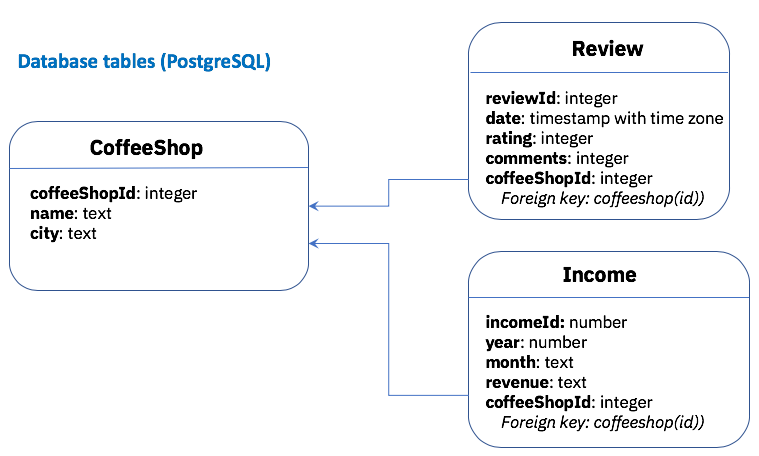

## Steps to add database constraints

After running `npm run migrate` to create the database table, you'll get the following table definitions for `coffeeshop`, `review` and `income`.

_Note: the following information and commands are being run using PostgreSQL._

```
# \d coffeeshop
                            Table "public.coffeeshop"
 Column |  Type   | Collation | Nullable |                Default
--------+---------+-----------+----------+----------------------------------------
 id     | integer |           | not null | nextval('coffeeshop_id_seq'::regclass)
 name   | text    |           | not null |
 city   | text    |           | not null |
Indexes:
    "coffeeshop_pkey" PRIMARY KEY, btree (id)

# \d review
                                           Table "public.review"
    Column    |           Type           | Collation | Nullable |                 Default
--------------+--------------------------+-----------+----------+------------------------------------------
 reviewid     | integer                  |           | not null | nextval('review_reviewid_seq'::regclass)
 date         | timestamp with time zone |           |          |
 rating       | integer                  |           |          |
 comments     | text                     |           | not null |
 coffeeshopid | integer                  |           |          |
Indexes:
    "review_pkey" PRIMARY KEY, btree (reviewid)


# \d income
                                Table "public.income"
  Column  |  Type   | Collation | Nullable |                 Default
----------+---------+-----------+----------+------------------------------------------
 incomeid | integer |           | not null | nextval('income_incomeid_seq'::regclass)
 year     | integer |           | not null |
 month    | integer |           | not null |
 revenue  | integer |           | not null |
Indexes:
    "income_pkey" PRIMARY KEY, btree (incomeid)
```

In the database, we need to add the foreign key constraints as follows:



## Review model

```
ALTER TABLE review ADD CONSTRAINT constraint_coffeeshopid FOREIGN KEY (coffeeshopid) REFERENCES coffeeshop (id);
```

```
# \d review
                                           Table "public.review"
    Column    |           Type           | Collation | Nullable |                 Default
--------------+--------------------------+-----------+----------+------------------------------------------
 reviewid     | integer                  |           | not null | nextval('review_reviewid_seq'::regclass)
 date         | timestamp with time zone |           |          |
 rating       | integer                  |           |          |
 comments     | text                     |           | not null |
 coffeeshopid | integer                  |           |          |
Indexes:
    "review_pkey" PRIMARY KEY, btree (reviewid)
Foreign-key constraints:
    "constraint_coffeeshopid" FOREIGN KEY (coffeeshopid) REFERENCES coffeeshop(id)


```

## Income model

```
ALTER TABLE income ADD CONSTRAINT constraint_coffeeshopid FOREIGN KEY (coffeeshopid) REFERENCES coffeeshop (id);
```

```
# \d income
                                  Table "public.income"
    Column    |  Type   | Collation | Nullable |                 Default
--------------+---------+-----------+----------+------------------------------------------
 incomeid     | integer |           | not null | nextval('income_incomeid_seq'::regclass)
 year         | integer |           | not null |
 month        | integer |           | not null |
 revenue      | integer |           | not null |
 coffeeshopid | integer |           |          |
Indexes:
    "income_pkey" PRIMARY KEY, btree (incomeid)
Foreign-key constraints:
    "constraint_coffeeshopid" FOREIGN KEY (coffeeshopid) REFERENCES coffeeshop(id)
```
